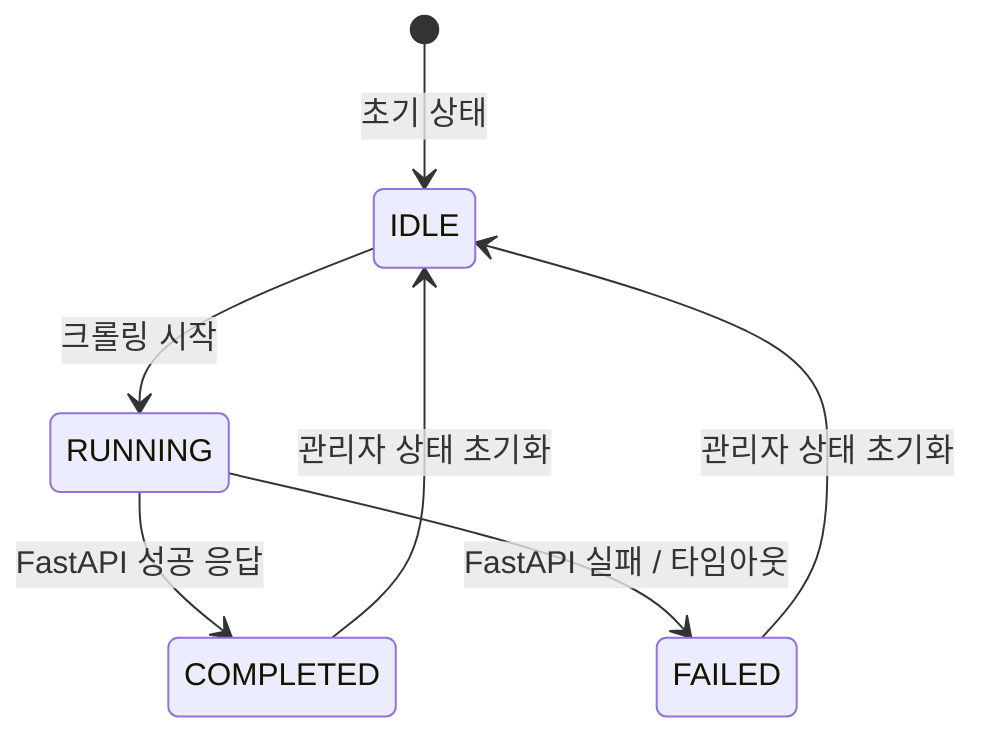

# 비즈니스 규칙 문서 (Business Rules Document)

## 1. Overview

**SwimColor**는 수영복(Swimsuit)과 수모(Swimcap)의 색상 매칭을 제공하는 서비스입니다.  
외부 쇼핑몰에서 상품을 크롤링하여 DB에 저장하고, FastAPI를 통해 색상 유사도를 계산하여 사용자에게 추천합니다.

### 핵심 도메인
- **크롤링(Crawling)**: 외부 사이트에서 수영복/수모 상품 정보를 수집
- **상품 관리(Product)**: 수영복, 수모 정보 저장 및 조회
- **색상 매칭(Color Matching)**: 수영복과 수모의 색상 유사도 계산 및 추천
- **관리자(Admin)**: 크롤링 작업 시작, 상태 관리

---

## 2. Terminology

| 용어 | 설명 | 비고                               |
|------|------|----------------------------------|
| **Swimsuit** | 수영복 상품 | ID 형식: `SS-0001`                 |
| **Swimcap** | 수모 상품 | ID 형식: `SC-0001`                 |
| **Crawling** | 외부 사이트에서 상품 정보 수집 | 비동기 처리, FastAPI 연동               |
| **CrawlStatus** | 크롤링 작업 상태 | `RUNNING`, `COMPLETED`, `FAILED` |
| **ColorMatch** | 수영복-수모 색상 유사도 매칭 정보 | FastAPI가 계산한 유사도 저장              |
| **CrawlingLog** | 크롤링 작업 이력 | 성공/실패 여부, 에러 메시지 포함              |
| **ItemType** | 상품 유형 구분 | `SWIMSUIT`, `SWIMCAP`            |
| **FastAPI** | 외부 Python 서버 | 크롤링 및 색상 유사도 계산 담당               |
| **Similarity Score** | 색상 유사도 점수 | Double 타입, 낮을수록 유사               |

---

## 3. Happy Path

### 3.1 크롤링 정상 플로우 (Swimsuit 기준)

```
1. 관리자가 POST /api/admin/crawlSwimsuits 호출 (URL 전달)
   ↓
2. CrawlStatusService: RUNNING 상태 저장
   ↓
3. CrawlingLog: RUNNING 상태로 로그 생성 (logId 발급)
   ↓
4. FastAPI 비동기 호출 (crawlSwimsuitsAsync)
   ↓
5. FastAPI가 크롤링 완료 후 POST /api/admin/callback/swimsuits 호출
   ↓
6. CrawlStatus: COMPLETED로 변경
   ↓
7. DB에 Swimsuit 엔티티 저장 (배치 insert)
   ↓
8. CrawlingLog: totalCount, executionTime 업데이트
```

### 3.2 추천 정상 플로우

```
1. 사용자가 POST /api/swimsuits/{id}/recommended-swimcaps 호출
   ↓
2. ColorMatch 테이블에서 {id}에 대한 매칭 데이터 조회
   ↓
3-1. 데이터 있음 → 저장된 swimcapId로 Swimcap 조회 → 반환
   ↓
3-2. 데이터 없음 → FastAPI 호출하여 유사도 계산
   ↓
4. FastAPI 응답값을 ColorMatch에 저장
   ↓
5. swimcapId로 Swimcap 조회 → 반환
```
---

## Validation Policy
- 요청 값 검증은 Controller 계층에서 수행한다.
- @Valid 기반 Validation 실패는 비즈니스 규칙 위반으로 간주하지 않는다.
- Validation은 “요청이 말이 되는지”, Business Rule은 “이걸 해도 되는지”다

---

## 4. Business Rules

### 4.1 크롤링 규칙 (Crawling Rules)

#### BR-CRAWL-001: 중복 크롤링 방지
- **설명**: 동일 ItemType에 대해 RUNNING 상태가 이미 존재하면 새로운 크롤링을 시작할 수 없음
- **조건**: `CrawlStatusService.getCrawlStatus(itemType) == "RUNNING"`
- **ErrorCode**: `CRAWLING_ALREADY_IN_PROGRESS`
- **HttpStatus**: `409 CONFLICT`

#### BR-CRAWL-002: 크롤링 URL 필수 => valid 처리
- **설명**: 크롤링 요청 시 sourceUrl은 필수이며 null이거나 빈 문자열일 수 없음
- **조건**: `requestDto.getCrawlingUrl() == null || requestDto.getCrawlingUrl().isBlank()`
- **ErrorCode**: `INVALID_CRAWLING_URL`
- **HttpStatus**: `400 BAD_REQUEST`

#### BR-CRAWL-003: FastAPI 연결 실패 시 로그 기록
- **설명**: FastAPI 서버 연결 실패 시 CrawlStatus를 FAILED로 변경하고 CrawlingLog에 에러 메시지 기록
- **조건**: `fastapiClient.crawlSwimsuitsAsync()` 예외 발생
- **ErrorCode**: `FASTAPI_CONNECTION_FAILED`
- **HttpStatus**: `503 SERVICE_UNAVAILABLE`

#### BR-CRAWL-004: 크롤링 로그 미존재
- **설명**: callback 시점에 logId에 해당하는 CrawlingLog가 없으면 예외 발생
- **조건**: `crawlingLogRepository.findById(logId).isEmpty()`
- **ErrorCode**: `CRAWLING_LOG_NOT_FOUND`
- **HttpStatus**: `404 NOT_FOUND`

#### BR-CRAWL-005: ItemType 불일치
- **설명**: API 경로와 실제 크롤링 대상 ItemType이 일치해야 함
- **조건**: `/crawlSwimsuits` 호출 시 ItemType이 SWIMCAP인 경우
- **ErrorCode**: `ITEM_TYPE_MISMATCH`
- **HttpStatus**: `400 BAD_REQUEST`

---

### 4.2 상품 규칙 (Product Rules)

#### BR-PRODUCT-001: 수영복 ID 중복 불가
- **설명**: Swimsuit ID는 고유해야 하며 중복 저장 시 예외 발생
- **조건**: `swimsuitRepository.existsById(swimsuitId)`
- **ErrorCode**: `SWIMSUIT_ALREADY_EXISTS`
- **HttpStatus**: `409 CONFLICT`

#### BR-PRODUCT-002: 수모 ID 중복 불가
- **설명**: Swimcap ID는 고유해야 하며 중복 저장 시 예외 발생
- **조건**: `swimcapRepository.existsById(swimcapId)`
- **ErrorCode**: `SWIMCAP_ALREADY_EXISTS`
- **HttpStatus**: `409 CONFLICT`

#### BR-PRODUCT-003: 상품 조회 실패
- **설명**: 존재하지 않는 상품 ID 조회 시 예외 발생
- **조건**: `swimsuitRepository.findById(id).isEmpty()`
- **ErrorCode**: `SWIMSUIT_NOT_FOUND`
- **HttpStatus**: `404 NOT_FOUND`

#### BR-PRODUCT-004: 필수 필드 누락 (상품명)
- **설명**: 상품명(name)은 필수이며 null 또는 빈 문자열 불가
- **조건**: `product.getName() == null || product.getName().isBlank()`
- **ErrorCode**: `PRODUCT_NAME_REQUIRED`
- **HttpStatus**: `400 BAD_REQUEST`

#### BR-PRODUCT-005: 필수 필드 누락 (이미지 URL)
- **설명**: 이미지 URL은 필수이며 null 또는 빈 문자열 불가
- **조건**: `product.getImageUrl() == null || product.getImageUrl().isBlank()`
- **ErrorCode**: `PRODUCT_IMAGE_URL_REQUIRED`
- **HttpStatus**: `400 BAD_REQUEST`

#### BR-PRODUCT-006: 필수 필드 누락 (상품 URL)
- **설명**: 상품 상세 페이지 URL은 필수
- **조건**: `product.getProductUrl() == null || product.getProductUrl().isBlank()`
- **ErrorCode**: `PRODUCT_URL_REQUIRED`
- **HttpStatus**: `400 BAD_REQUEST`

#### BR-PRODUCT-007: 가격 음수 불가
- **설명**: 상품 가격은 0 이상이어야 함
- **조건**: `product.getPrice() < 0`
- **ErrorCode**: `INVALID_PRODUCT_PRICE`
- **HttpStatus**: `400 BAD_REQUEST`

#### BR-PRODUCT-008: 색상 팔레트 선택 -> 색상 정보가 없는 경우 있음

---

### 4.3 색상 매칭 규칙 (Color Matching Rules)

#### BR-MATCH-001: 수영복 ID 필수
- **설명**: 추천 요청 시 swimsuitId는 필수이며 존재하는 상품이어야 함
- **조건**: `swimsuitRepository.findById(swimsuitId).isEmpty()`
- **ErrorCode**: `SWIMSUIT_NOT_FOUND`
- **HttpStatus**: `404 NOT_FOUND`

#### BR-MATCH-002: 색상 리스트 필수
- **설명**: 추천 요청 시 colors 파라미터는 최소 1개 이상 포함되어야 함
- **조건**: `requestDto.getColors() == null || requestDto.getColors().isEmpty()`
- **ErrorCode**: `COLORS_REQUIRED`
- **HttpStatus**: `400 BAD_REQUEST`

#### BR-MATCH-003: FastAPI 추천 실패
- **설명**: FastAPI 색상 유사도 계산 실패 시 예외 발생
- **조건**: `fastapiClient.getRecommendSwimcap()` 예외 발생
- **ErrorCode**: `RECOMMENDATION_FAILED`
- **HttpStatus**: `500 INTERNAL_SERVER_ERROR`

#### BR-MATCH-004: ColorMatch 중복 저장 방지
- **설명**: 동일한 swimsuitId-swimcapId 조합이 이미 존재하면 업데이트만 수행
- **조건**: `colorMatchRepository.findBySwimsuitIdAndSwimcapId(swimsuitId, swimcapId).isPresent()`
- **ErrorCode**: 예외 발생 안 함 (update 로직)
- **HttpStatus**: N/A

---

### 4.4 관리자 규칙 (Admin Rules)

#### BR-ADMIN-001: 크롤링 강제 중단 권한
- **설명**: 관리자는 RUNNING 상태의 크롤링을 강제로 FAILED 처리 가능
- **조건**: DELETE `/api/crawling/status/{category}` 호출
- **ErrorCode**: N/A (정상 처리)
- **HttpStatus**: `200 OK`

#### BR-ADMIN-002: 상태 조회 시 ItemType 검증
- **설명**: category 파라미터는 SWIMSUIT 또는 SWIMCAP만 허용
- **조건**: `!category.equals("SWIMSUIT") && !category.equals("SWIMCAP")`
- **ErrorCode**: `INVALID_ITEM_TYPE`
- **HttpStatus**: `400 BAD_REQUEST`

#### BR-ADMIN-003: 크롤링 로그 조회 권한
- **설명**: 관리자는 모든 크롤링 로그 조회 가능 (일반 사용자 불가)
- **조건**: 인증 헤더 없거나 ADMIN 역할 없음
- **ErrorCode**: `FORBIDDEN`
- **HttpStatus**: `403 FORBIDDEN`

---

## 5. Failure Scenarios & Error Mapping

| Scenario | Business Rule | ErrorCode | HttpStatus | Response Example |
|----------|--------------|-----------|------------|------------------|
| 크롤링 중복 실행 시도 | BR-CRAWL-001 | `CRAWLING_ALREADY_IN_PROGRESS` | `409` | `{"errorCode":"CRAWLING_ALREADY_IN_PROGRESS","message":"해당 카테고리의 크롤링이 이미 실행 중입니다.","timestamp":"2026-01-12T10:30:00"}` |
| 크롤링 URL 누락 | BR-CRAWL-002 | `INVALID_CRAWLING_URL` | `400` | `{"errorCode":"INVALID_CRAWLING_URL","message":"크롤링 URL은 필수입니다."}` |
| FastAPI 서버 다운 | BR-CRAWL-003 | `FASTAPI_CONNECTION_FAILED` | `503` | `{"errorCode":"FASTAPI_CONNECTION_FAILED","message":"외부 크롤링 서버와 연결할 수 없습니다."}` |
| 존재하지 않는 로그 ID | BR-CRAWL-004 | `CRAWLING_LOG_NOT_FOUND` | `404` | `{"errorCode":"CRAWLING_LOG_NOT_FOUND","message":"크롤링 로그를 찾을 수 없습니다. logId: 123"}` |
| 잘못된 ItemType | BR-CRAWL-005 | `ITEM_TYPE_MISMATCH` | `400` | `{"errorCode":"ITEM_TYPE_MISMATCH","message":"요청 경로와 아이템 타입이 일치하지 않습니다."}` |
| 수영복 ID 중복 | BR-PRODUCT-001 | `SWIMSUIT_ALREADY_EXISTS` | `409` | `{"errorCode":"SWIMSUIT_ALREADY_EXISTS","message":"이미 존재하는 수영복 ID입니다."}` |
| 존재하지 않는 상품 조회 | BR-PRODUCT-003 | `SWIMSUIT_NOT_FOUND` | `404` | `{"errorCode":"SWIMSUIT_NOT_FOUND","message":"해당 수영복을 찾을 수 없습니다. id: SS-9999"}` |
| 상품명 누락 | BR-PRODUCT-004 | `PRODUCT_NAME_REQUIRED` | `400` | `{"errorCode":"PRODUCT_NAME_REQUIRED","message":"상품명은 필수입니다."}` |
| 음수 가격 입력 | BR-PRODUCT-007 | `INVALID_PRODUCT_PRICE` | `400` | `{"errorCode":"INVALID_PRODUCT_PRICE","message":"상품 가격은 0 이상이어야 합니다."}` |
| 색상 정보 없음 | BR-PRODUCT-008 | `PRODUCT_COLORS_REQUIRED` | `400` | `{"errorCode":"PRODUCT_COLORS_REQUIRED","message":"상품 색상 정보는 최소 1개 이상 필요합니다."}` |
| 추천 시 수영복 없음 | BR-MATCH-001 | `SWIMSUIT_NOT_FOUND` | `404` | `{"errorCode":"SWIMSUIT_NOT_FOUND","message":"해당 수영복을 찾을 수 없습니다."}` |
| 색상 리스트 누락 | BR-MATCH-002 | `COLORS_REQUIRED` | `400` | `{"errorCode":"COLORS_REQUIRED","message":"추천을 위한 색상 정보가 필요합니다."}` |
| FastAPI 추천 실패 | BR-MATCH-003 | `RECOMMENDATION_FAILED` | `500` | `{"errorCode":"RECOMMENDATION_FAILED","message":"색상 추천 중 오류가 발생했습니다."}` |
| 유사도 점수 범위 초과 | BR-MATCH-004 | `INVALID_SIMILARITY_SCORE` | `400` | `{"errorCode":"INVALID_SIMILARITY_SCORE","message":"유사도 점수는 0.0~1.0 범위여야 합니다."}` |
| 잘못된 카테고리 입력 | BR-ADMIN-002 | `INVALID_ITEM_TYPE` | `400` | `{"errorCode":"INVALID_ITEM_TYPE","message":"유효하지 않은 카테고리입니다. SWIMSUIT 또는 SWIMCAP만 허용됩니다."}` |
| 관리자 권한 없음 | BR-ADMIN-003 | `FORBIDDEN` | `403` | `{"errorCode":"FORBIDDEN","message":"관리자 권한이 필요합니다."}` |

---

## 6. Authorization Rules

현재 프로젝트는 **인증/인가 미구현** 상태입니다.  
향후 Spring Security 적용 시 아래 규칙을 참고하세요.

### AUTH-001: 크롤링 API는 ADMIN 권한 필요
- **Endpoint**: `/api/admin/**`
- **Required Role**: `ROLE_ADMIN`
- **ErrorCode**: `FORBIDDEN`
- **HttpStatus**: `403`

### AUTH-002: 상품 조회는 인증 불필요 (Public)
- **Endpoint**: `/api/swimsuits/**` (GET)
- **Required Role**: None (Public Access)

---

## 7. State Transition Rules

### 7.1 CrawlStatus 상태 전이



### 상태 전이 규칙

#### STATE-001: IDLE → RUNNING
- **트리거**: `POST /api/admin/crawlSwimsuits` 또는 `crawlSwimcaps` 호출
- **조건**: 현재 상태가 IDLE이거나 존재하지 않음
- **실패 조건**: 이미 RUNNING 상태 (BR-CRAWL-001)

#### STATE-002: RUNNING → COMPLETED
- **트리거**: FastAPI callback 성공 (`CrawlStatus.COMPLETED`)
- **조건**: logId에 해당하는 CrawlingLog 존재
- **후처리**:
    - DB에 상품 저장
    - CrawlingLog의 totalCount, executionTime 업데이트

#### STATE-003: RUNNING → FAILED
- **트리거**:
    - FastAPI 연결 실패
    - FastAPI callback 실패 (`CrawlStatus.FAILED`)
    - 관리자 강제 중단 (`DELETE /api/crawling/status/{category}`)
- **후처리**:
    - CrawlingLog에 errorMessage 기록
    - executionTime 기록 (가능한 경우)

#### STATE-004: COMPLETED/FAILED → IDLE
- **트리거**: 관리자가 `DELETE /api/crawling/status/{category}` 호출
- **조건**: 상태가 COMPLETED 또는 FAILED
- **효과**: CrawlStatus Map에서 해당 ItemType 제거

---

## 8. Exception 설계 가이드

### 8.1 Custom Exception 클래스 구조

```java
// 1. 최상위 비즈니스 예외
public class BusinessException extends RuntimeException {
    private final ErrorCode errorCode;
    
    public BusinessException(ErrorCode errorCode) {
        super(errorCode.getMessage());
        this.errorCode = errorCode;
    }
}

// 2. 도메인별 예외 (선택사항)
public class CrawlingException extends BusinessException {
    public CrawlingException(ErrorCode errorCode) {
        super(errorCode);
    }
}

public class ProductException extends BusinessException {
    public ProductException(ErrorCode errorCode) {
        super(errorCode);
    }
}
```

### 8.2 ErrorCode Enum 설계

```java
public enum ErrorCode {
    // Crawling Errors
    CRAWLING_ALREADY_IN_PROGRESS(HttpStatus.CONFLICT, "CRAWL-001", "해당 카테고리의 크롤링이 이미 실행 중입니다."),
    INVALID_CRAWLING_URL(HttpStatus.BAD_REQUEST, "CRAWL-002", "크롤링 URL은 필수입니다."),
    FASTAPI_CONNECTION_FAILED(HttpStatus.SERVICE_UNAVAILABLE, "CRAWL-003", "외부 크롤링 서버와 연결할 수 없습니다."),
    CRAWLING_LOG_NOT_FOUND(HttpStatus.NOT_FOUND, "CRAWL-004", "크롤링 로그를 찾을 수 없습니다."),
    ITEM_TYPE_MISMATCH(HttpStatus.BAD_REQUEST, "CRAWL-005", "요청 경로와 아이템 타입이 일치하지 않습니다."),
    
    // Product Errors
    SWIMSUIT_ALREADY_EXISTS(HttpStatus.CONFLICT, "PRODUCT-001", "이미 존재하는 수영복 ID입니다."),
    SWIMCAP_ALREADY_EXISTS(HttpStatus.CONFLICT, "PRODUCT-002", "이미 존재하는 수모 ID입니다."),
    SWIMSUIT_NOT_FOUND(HttpStatus.NOT_FOUND, "PRODUCT-003", "해당 수영복을 찾을 수 없습니다."),
    PRODUCT_NAME_REQUIRED(HttpStatus.BAD_REQUEST, "PRODUCT-004", "상품명은 필수입니다."),
    PRODUCT_IMAGE_URL_REQUIRED(HttpStatus.BAD_REQUEST, "PRODUCT-005", "이미지 URL은 필수입니다."),
    PRODUCT_URL_REQUIRED(HttpStatus.BAD_REQUEST, "PRODUCT-006", "상품 URL은 필수입니다."),
    INVALID_PRODUCT_PRICE(HttpStatus.BAD_REQUEST, "PRODUCT-007", "상품 가격은 0 이상이어야 합니다."),
    PRODUCT_COLORS_REQUIRED(HttpStatus.BAD_REQUEST, "PRODUCT-008", "상품 색상 정보는 최소 1개 이상 필요합니다."),
    
    // Color Matching Errors
    COLORS_REQUIRED(HttpStatus.BAD_REQUEST, "MATCH-002", "추천을 위한 색상 정보가 필요합니다."),
    RECOMMENDATION_FAILED(HttpStatus.INTERNAL_SERVER_ERROR, "MATCH-003", "색상 추천 중 오류가 발생했습니다."),
    INVALID_SIMILARITY_SCORE(HttpStatus.BAD_REQUEST, "MATCH-004", "유사도 점수는 0.0~1.0 범위여야 합니다."),
    
    // Admin Errors
    INVALID_ITEM_TYPE(HttpStatus.BAD_REQUEST, "ADMIN-002", "유효하지 않은 카테고리입니다."),
    FORBIDDEN(HttpStatus.FORBIDDEN, "ADMIN-003", "관리자 권한이 필요합니다.");
    
    private final HttpStatus status;
    private final String code;
    private final String message;
    
    ErrorCode(HttpStatus status, String code, String message) {
        this.status = status;
        this.code = code;
        this.message = message;
    }
    
    // getters...
}
```

### 8.3 GlobalExceptionHandler

```java
@RestControllerAdvice
public class GlobalExceptionHandler {
    
    @ExceptionHandler(BusinessException.class)
    public ResponseEntity<ErrorResponse> handleBusinessException(BusinessException e) {
        ErrorResponse response = ErrorResponse.builder()
            .errorCode(e.getErrorCode().getCode())
            .message(e.getMessage())
            .timestamp(LocalDateTime.now())
            .build();
            
        return ResponseEntity
            .status(e.getErrorCode().getStatus())
            .body(response);
    }
    
    @ExceptionHandler(Exception.class)
    public ResponseEntity<ErrorResponse> handleException(Exception e) {
        ErrorResponse response = ErrorResponse.builder()
            .errorCode("INTERNAL-ERROR")
            .message("서버 내부 오류가 발생했습니다.")
            .timestamp(LocalDateTime.now())
            .build();
            
        return ResponseEntity
            .status(HttpStatus.INTERNAL_SERVER_ERROR)
            .body(response);
    }
}
```

---

## 9. 테스트 가이드

각 Business Rule은 다음과 같이 테스트 가능해야 합니다:

```java
@Test
@DisplayName("BR-CRAWL-001: 중복 크롤링 방지 테스트")
void testDuplicateCrawlingPrevention() {
    // given
    crawlStatusService.runSwimsuitCrawling(); // RUNNING 상태 설정
    
    // when & then
    assertThatThrownBy(() -> adminService.crawlSwimsuits("http://test.com"))
        .isInstanceOf(CrawlingException.class)
        .hasFieldOrPropertyWithValue("errorCode", ErrorCode.CRAWLING_ALREADY_IN_PROGRESS);
}
```

---

## 문서 이력

| 버전 | 작성일 | 작성자 | 변경 내용 |
|------|--------|--------|-----------|
| 1.0 | 2026-01-12 | AI Assistant | 초안 작성 |